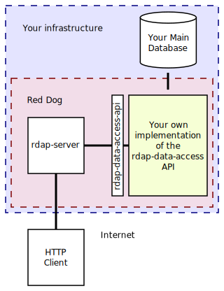

# Introduction to RDAP/Red Dog

## Index

1. [What is RDAP?](#what-is-rdap)
2. [What is Red Dog?](#what-is-red-dog)	

## What is RDAP?

RDAP (_Registration Data Access Protocol_) is a successor of WHOIS--a protocol used for querying information regarding Internet resources (such as domain names, IP addresses and autonomous system numbers). RDAP is based on a typical client-server model. The server is a RESTful service expected to provide HTTP content in accordance with RFCs [7480](https://tools.ietf.org/html/rfc7480), [7481](https://tools.ietf.org/html/rfc7481), [7482](https://tools.ietf.org/html/rfc7482) and [7483](https://tools.ietf.org/html/rfc7483).

Some advantages of RDAP over WHOIS are

- Standardized request and response formats, in contrast to WHOIS' provider-defined arbitrary text.
- Reliance on Representational State Transfer (REST) technologies, a strong base which is widely known.
- Bootstrapping, the automatic determination of where a query should be sent.
- Support for Internationalized Domain Names and support for localized registration data.
- Support for identification, authentication and access control to the service.

## What is Red Dog?

Red Dog is a free and open source Java implementation of an RDAP server carcass.

Through your implementation of the data access API, Red Dog can serve Internet resources in a standard manner. The idea is to reduce your task as an RDAP implementor to the data-access half.

By implementing the [data access API](https://github.com/NICMx/rdap-data-access-api), you can wrap `Your Main Database` to `rdap-server` in any way you want, which can range as anything from direct queries to `Your Main Database` to queries to non-relational databases.

